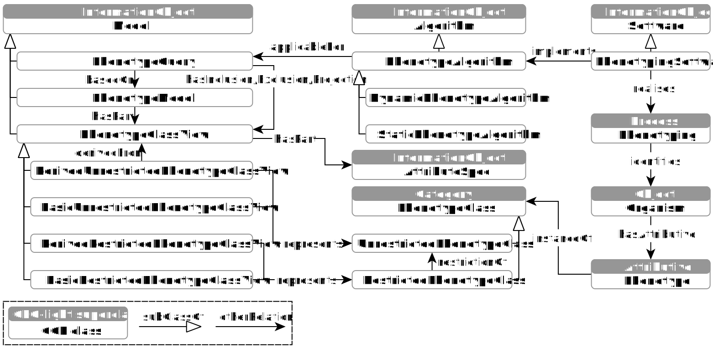

# Core Ontology of Phenotyping (COP)

 

## Introduction

The Core Ontology of Phenotyping (COP) defines core entities relevant to the modelling of phenotypic knowledge and the development of model-driven phenotyping software (such as the [TOP Framework](https://github.com/Onto-Med/top-deployment)).
The COP is founded on [GFO-light](https://github.com/Onto-Med/gfo-light).

Browse Ontology: [RDF Browser](https://top.imise.uni-leipzig.de/ontology/cop/)

**Figure 1. COP (overview).** *A run of a phenotyping software (implementing a phenotype algorithm) realises a phenotyping process, i.e., identifies individuals with certain phenotypes (traits or characteristics). Phenotype algorithms describe the execution of phenotype queries, which are based on phenotype models consisting of phenotype class views, which represent phenotype classes instantiated by phenotypes. Phenotype class views consist of attribute specifications (such as title, data type, unit of measure, terminology code, derivation expression, value range, etc.).*

### Phenotypes and phenotype classes
The COP distinguishes between **phenotypes**, i.e., individual traits or characteristics (*gfo-light:Attributive*) and **phenotype classes** (*gfo-light:Category*), which are instantiated by phenotypes.
Examples of phenotype classes are (abstract) categories such as 'weight', 'overweight' or 'body mass index (BMI)', which are instantiated by the weight, overweight and BMI properties (attributives) of specific individuals.
Phenotype classes can be **restricted** or **unrestricted**, depending on whether the set of their instances (i.e., phenotypes) is restricted to a certain value range (e.g., 'overweight', i.e., BMI values must be above 30) or not (e.g., 'BMI', i.e., all BMI values are allowed).

### Phenotype models and queries
To model phenotypic knowledge, **phenotype models** can be developed that consist of the phenotype class views representing the phenotype classes.
There are four types of phenotype class views, which result on the one hand from the type of phenotype class (restricted or unrestricted) and on the other hand from the role (basic or derived) that the class should play in the specific model.
**Basic unrestricted phenotype class views** (e.g., specification of the phenotype class 'weight') mean that the instances (phenotypes) of the corresponding unrestricted phenotype classes have already been determined and can be queried from the data source.
**Derived unrestricted phenotype class views**, on the other hand, represent unrestricted phenotype classes whose instances (phenotypes) need to be determined (i.e., derived from other phenotypes, e.g., 'BMI' from 'weight' and 'height').
**Basic restricted phenotype class views** and **derived restricted phenotype class views** represent the corresponding restricted phenotype classes (e.g., 'weight over 100 kg' and 'overweight/BMI over 30').
Phenotype class views consist of **attribute specifications** (such as title, data type, unit of measure, terminology code, derivation expression, value range, etc.).

Phenotype queries can be specified based on phenotype models.
A **phenotype query** is a specification of certain phenotype classes as inclusion or exclusion criteria (e.g., male and overweight and no heart attack).

### Phenotyping
**Phenotyping** is a process (*gfo-light:Process*) of identifying individuals (*gfo-light:Object*) with certain phenotypes.
The software that realises the phenotyping is called **phenotyping software**.
Phenotyping software implements a static or dynamic phenotype algorithm.
**Static phenotype algorithms** describe the execution of exactly one specific phenotype query, while **dynamic phenotype algorithms** support arbitrary phenotype queries.

## Contribution and Development

Please see our [Contributing Guide](CONTRIBUTING.md).

## References

The ontology was initially named the Core Ontology of Phenotypes.
However, its scope was later expanded, prompting a name change. You may encounter references using the older name.

> Uciteli A, Beger C, Kirsten T, Meineke FA, Herre H. Ontological representation, classification and data-driven computing of phenotypes. J Biomed Semant 2020;11:15. https://doi.org/10.1186/s13326-020-00230-0.

> Uciteli A, Beger C, Kirsten T, Meineke FA, Herre H. Ontological Modelling and Reasoning of Phenotypes. Proceedings of the Joint Ontology Workshops 2019 Episode V: The Styrian Autumn of Ontology, Graz: 2019. [[PDF](http://ceur-ws.org/Vol-2518/paper-ODLS11.pdf)]
