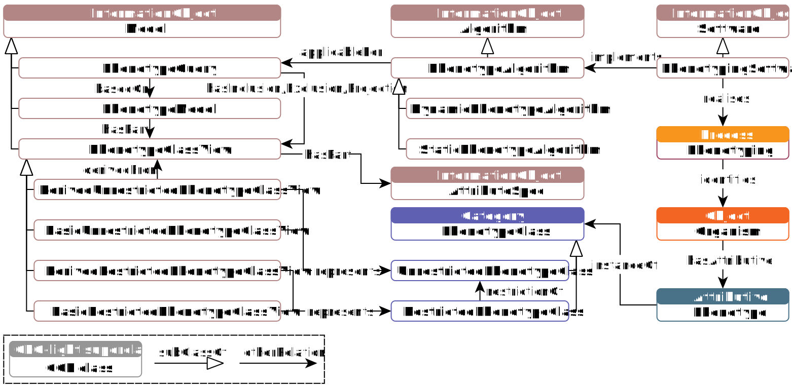

# Core Ontology of Phenotyping (COP)

 

## Introduction

The Core Ontology of Phenotyping (COP) defines core entities and their relationships that are relevant for modelling phenotypic knowledge and developing phenotyping software. The COP is founded on [GFO-light](https://github.com/Onto-Med/gfo-light).

Browse Ontology: [RDF Browser](https://top.imise.uni-leipzig.de/ontology/cop/)

**Figure 1. COP (overview)**

*A run of a phenotyping software (implementing a phenotype algorithm) realises a phenotyping process, i.e., identifies individuals with certain phenotypes (traits or characteristics). Phenotype algorithms describe the execution of phenotype queries, which are based on phenotype models consisting of phenotype class views, which represent phenotype classes instantiated by phenotypes. Phenotype class views consist of attribute specifications (such as title, data type, unit of measure, terminology code, derivation expression, value range, etc.).*

## Contribution and Development

Please see our [Contributing Guide](CONTRIBUTING.md).

## References

The ontology was initially named the Core Ontology of Phenotypes. However, its scope was later expanded, prompting a name change. You may encounter references using the older name.

> Uciteli A, Beger C, Kirsten T, Meineke FA, Herre H. Ontological representation, classification and data-driven computing of phenotypes. J Biomed Semant 2020;11:15. https://doi.org/10.1186/s13326-020-00230-0.

> Uciteli A, Beger C, Kirsten T, Meineke FA, Herre H. Ontological Modelling and Reasoning of Phenotypes. Proceedings of the Joint Ontology Workshops 2019 Episode V: The Styrian Autumn of Ontology, Graz: 2019. [[PDF](http://ceur-ws.org/Vol-2518/paper-ODLS11.pdf)]
